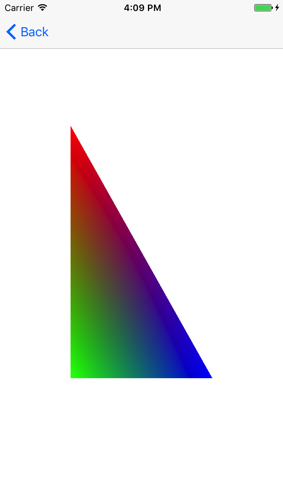
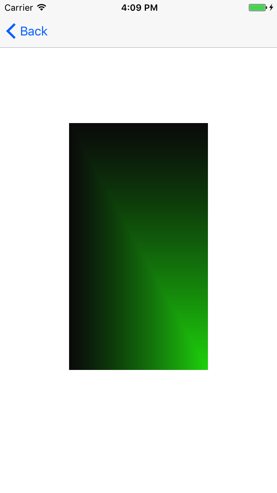

# iOS_OpenGL

### 顶点输入

#### 一个顶点数组对象会储存以下这些内容：

* glEnableVertexAttribArray和glDisableVertexAttribArray的调用。
* 通过glVertexAttribPointer设置的顶点属性配置。
* 通过glVertexAttribPointer调用与顶点属性关联的顶点缓冲对象。

#### 三角形
<pre>
float vertices[] = {
    -0.5f, -0.5f, 0.0f,
     0.5f, -0.5f, 0.0f,
     0.0f,  0.5f, 0.0f
};
</pre>

#### 多边形
<pre>
typedef struct {
    GLfloat Positon[3];//位置
    GLfloat Color[4];//颜色
    
} Vertex;

顶点和颜色数组
const Vertex squareVertexData[] = {
    
    { 0.5f,  0.5f, -0.9f,  1.0f, 0.0f, 0.0f, 1.0f},  //0
    {-0.5f,  0.5f, -0.9f,  0.0f, 1.0f, 0.0f, 1.0f},  //1
    { 0.5f, -0.5f, -0.9f,  0.0f, 0.0f, 1.0f, 1.0f},  //2
    {-0.5f, -0.5f, -0.9f,  0.0f, 0.0f, 0.0f, 1.0f}   //3
    
};
三角形数组
const GLubyte Indices[] = {
    0, 1, 2,
    2, 1, 3
};
</pre>

### 顶点数组对象：Vertex Array Object，VBO

* 使用glGenBuffers函数和一个缓冲ID生成一个VBO对象：
unsigned int VBO;
glGenBuffers(1, &VBO);

* glBindBuffer函数把新创建的缓冲绑定到GL_ARRAY_BUFFER目标上：
glBindBuffer(GL_ARRAY_BUFFER, VBO);  

* 我们可以调用glBufferData函数，它会把之前定义的顶点数据复制到缓冲的内存中：
glBufferData(GL_ARRAY_BUFFER, sizeof(vertices), vertices, GL_STATIC_DRAW);
glBufferData：

1. 它的第一个参数是目标缓冲的类型：顶点缓冲对象当前绑定到GL_ARRAY_BUFFER目标上
2. 第二个参数指定传输数据的大小(以字节为单位)；用一个简单的sizeof计算出顶点数据大小就行
3. 第三个参数是我们希望发送的实际数据。
4. 第四个参数指定了我们希望显卡如何管理给定的数据
   * GL_STATIC_DRAW ：数据不会或几乎不会改变。
   * GL_DYNAMIC_DRAW：数据会被改变很多。
   * GL_STREAM_DRAW ：数据每次绘制时都会改变。
  
现在我们已经把顶点数据储存在显卡的内存中，用VBO这个顶点缓冲对象管理

* 创建一个VAO和创建一个VBO很类似：
unsigned int VAO;
glGenVertexArrays(1, &VAO);

* 要想使用VAO，要做的只是使用glBindVertexArray绑定VAO
   1. 绑定VAO
glBindVertexArray(VAO);
   2. 把顶点数组复制到缓冲中供OpenGL使用
glBindBuffer(GL_ARRAY_BUFFER, VBO);
glBufferData(GL_ARRAY_BUFFER, sizeof(vertices), vertices, GL_STATIC_DRAW);
   3. 设置顶点属性指针
glVertexAttribPointer(0, 3, GL_FLOAT, GL_FALSE, 3 * sizeof(float), (void*)0);
glEnableVertexAttribArray(0);

###  GLKViewDelegate
   
  1. 启动着色器
  2. 添加背景颜色
  3. 绘制图形
<pre>
-(void)glkView:(GLKView *)view drawInRect:(CGRect)rect
{
    [TLEffect prepareToDraw];
    glClearColor(1.0f, 1.0f, 1.0f, 1.0f);
    glClear(GL_COLOR_BUFFER_BIT | GL_DEPTH_BUFFER_BIT);
    glDrawArrays(GL_TRIANGLES, 0, 3);    
}
</pre>

### 在GLKView上绘制OpenGL内容
<pre>
- (void)setupContext{
    
    context = [[EAGLContext alloc]initWithAPI:kEAGLRenderingAPIOpenGLES2];
    if (!context) {
        NSLog(@"Failed to initialize OpenGLES 2.0 context");
        exit(1);
    }
    [EAGLContext setCurrentContext:context];
    GLKView *view = [[GLKView alloc]init];
    view.delegate = self;
    view.frame = self.view.frame;
    view.context = context;
    
    view.drawableColorFormat = GLKViewDrawableColorFormatRGBA8888;
    if (![EAGLContext setCurrentContext:context]) {
        NSLog(@"Failed to set current OpenGL context");
        exit(1);
    }
    [self.view addSubview:view];
}
</pre>

